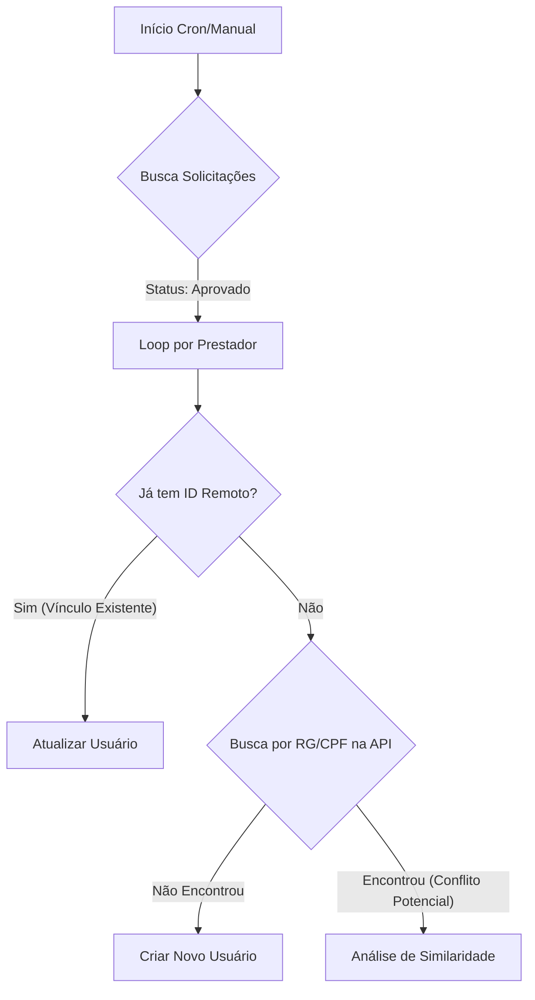

# Relatório Técnico: Lógica de Sincronização e Resolução de Conflitos

**Data:** 18/02/2026
**Script:** `scripts/sync-id-control-hebraica.js`
**Objetivo:** Explicar o fluxo lógico de decisão do robô de integração entre o Sistema de Gestão (Supabase) e o Controle de Acesso (ID Control).

## 1. Visão Geral do Fluxo

O script opera em lote, processando as últimas solicitações aprovadas que ainda não foram sincronizadas ou que precisam de atualização.

## 2. A Inteligência de Conflitos (Smart Conflict Resolution)

O ponto crítico do sistema é quando o robô tenta cadastrar alguém, mas o RG já existe no banco de dados do ID Control. O script toma decisões baseadas em **Nome** e **CPF** para evitar duplicidades e erros bloqueantes.

### A. Validação de Nome (Segurança)
Antes de alterar qualquer dado sensível, o robô compara o nome da solicitação com o nome existente no ID Control.
*   **Similaridade > 60%:** Assume que é a mesma pessoa (ex: "Jose Silva" vs "José da Silva"). -> **Permite Atualização.**
*   **Similaridade < 60%:** Alerta de conflito grave (ex: "Maria Souza" usando RG de "Carlos Pereira"). -> **Vai para o Desempate por CPF.**

### B. O Desempate por CPF (Logística "Takeover")
Quando os nomes são diferentes, o sistema tenta entender se é um erro de cadastro antigo ou uma tentativa de fraude.

**Cenário 1: CPF Coincide**
*   **Situação:** O RG é igual e o CPF também, mas o nome é totalmente diferente.
*   **Decisão:** Assume que a pessoa mudou de nome (casamento) ou o cadastro antigo estava muito errado.
*   **Ação:** ✅ **Atualiza** o cadastro existente com os novos dados.

**Cenário 2: "Takeover" (Tomada de Conta)**
*   **Situação:** O cadastro antigo no ID Control tem RG, mas **NÃO TEM CPF**. A nova solicitação tem RG e **TEM CPF**.
*   **Análise:** Cadastros sem CPF geralmente são antigos ou incompletos ("lixo"). O novo cadastro com CPF é mais "forte".
*   **Ação:**
    1.  **Libera o RG:** Altera o RG do usuário antigo para `FILA_12345_TIMESTAMP`.
    2.  **Cria o Novo:** Insere o novo usuário imediatamente com o RG correto e CPF.
    3.  **Resultado:** O novo funcionário entra, o antigo fica preservado (com RG alterado) para histórico.

**Cenário 3: Conflito Real (Bloqueio)**
*   **Situação:** O cadastro antigo tem CPF diferente ou ambos não têm CPF.
*   **Decisão:** Não é seguro substituir. Pode ser duplicidade real de documento físico.
*   **Ação:** 🚫 **Bloqueia**.
    *   Marca status como `Reprovado` no sistema.
    *   Adiciona tag `[ERRO RG]` na observação.
    *   Exibe mensagem amigável para o solicitante corrigir.

## 3. Feedback Visual (Status)

O robô atualiza o Supabase com o resultado da operação para que os painéis administrativos e do solicitante reflitam a realidade:

| Resultado | Status Supabase | Tag Observação | Ação do Usuário |
| :--- | :--- | :--- | :--- |
| **Sucesso** | `Aprovado` | "Integrado em..." | Nenhuma. Acesso liberado. |
| **Conflito RG** | `Reprovado` | `[ERRO RG]` | Botão "Corrigir Documentos" aparece. |
| **Erro Técnico** | Mantém `Aprovado` | Log de erro | TI verifica logs. |

---
**Observação Importante:**
Conforme detalhado no "Relatório de Limitação da API", a etapa de **Busca por RG/CPF (Passo F)** e, consequentemente, a **Análise de Similaridade (Passo H)** dependem da funcionalidade de listagem da API do ID Control, que atualmente encontra-se indisponível. Até que isso seja corrigido, o sistema adotará o comportamento de segurança padrão: **Bloquear duplicidades informando o erro**.
